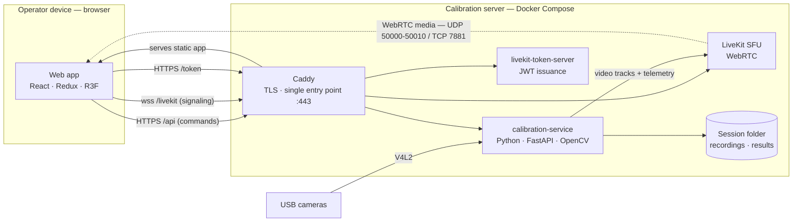
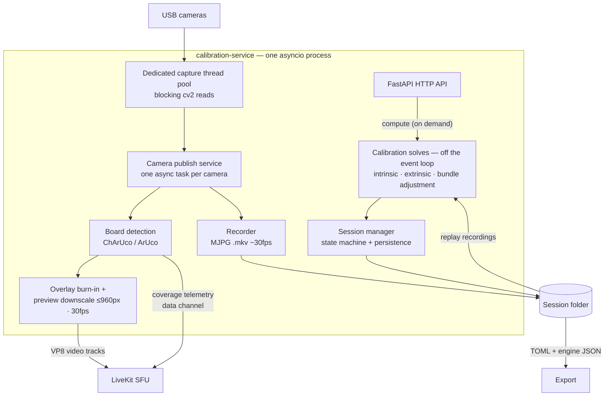

# Architecture overview

realtime-calib is a small set of services orchestrated with Docker Compose, built
around one idea: the heavy lifting (capture, detection, calibration) happens on the
**server the cameras are plugged into**, and the operator drives it from a
**web app on any device** over the local network.

## How this project was built

I'm a **PhD in human-movement science and a computer-vision developer**: my work is
building applied technology for **health and sport**. I'll delimit my expertise up
front, the way a researcher scopes their field before presenting a result — because
it matters here. I'm comfortable with engineering, product design and *applying*
computer vision, but I do **not** have deep training in the projective geometry and
epipolar mathematics that underpin camera calibration.

So for the calibration theory I stand on **Caliscope** and **OpenCV**, and I used
**Claude Code (mostly Opus 4.8)** to write the code and to explain the harder
concepts as I went.

I first used Caliscope in my own work. It calibrates well, but a few frictions kept
getting in the way — recording every camera in OBS first, no headless path, and
export conventions that didn't match my projects. As VR and robotics keep growing
the need for multi-camera rigs, it seemed worth turning a friction-free version
into something others could use too.

My own contribution is therefore the **product and engineering shape**, not the
calibration math: a **single-pass, multi-device** tool — a responsive web app that
captures *and* calibrates in one flow, usable on **headless Linux** servers — and
the **architecture and stack** (a dual-channel WebRTC React application over
LiveKit).

## System topology

| Service | Role | Stack |
| --- | --- | --- |
| `calibration-service` | Capture, board detection, overlay burn-in, LiveKit publishing, calibration solves (intrinsic / extrinsic / bundle adjustment), HTTP API, session state | Python 3.12, FastAPI + asyncio, OpenCV, SciPy, LiveKit SDK |
| `calibration-webapp` | Operator wizard + 3D review, served as static files by Caddy | React, TypeScript, Vite, Mantine, Redux Toolkit, R3F/drei |
| `livekit-token-server` | Issues subscribe-only LiveKit JWTs to the web app | Python (Flask) |
| `caddy` | Reverse proxy, TLS termination, static serving — the **only host-exposed entry point** | Caddy v2 |
| `livekit` | WebRTC SFU carrying the camera streams and the telemetry data channel | upstream `livekit/livekit-server` |

It is a **single stack**: Caddy (TLS) is the always-on entry point — tablet via
`https://<HOST_IP>`, same-machine via `https://localhost`. Caddy routes `/api` to
the calibration service, `/token` to the token server, `/livekit` to LiveKit
signaling, and serves the web app for everything else. Only the WebRTC **media**
flows outside Caddy, directly between browser and SFU.

## Two channels: commands vs. real time

The web app talks to the server over two complementary paths:

- **HTTP (through `/api`)** — everything transactional: create/open sessions,
  configure cameras and boards, start/stop sweeps, trigger computes, export.
  The service owns the session state; the web app rehydrates from it.
- **WebRTC (through LiveKit)** — everything continuous: one video track per
  camera (with detection overlays burned in server-side), plus a **data channel**
  pushing live quality telemetry (coverage, sharpness, co-visibility).

## Inside the calibration service

A single asyncio process; blocking work never runs on the event loop.

Key properties:

- **Capture stays native** — detection and recording run at the camera's real
  resolution; only the published preview is downscaled and rate-capped to spare
  the CPU encoder.
- **Solves are on-demand and replay-based** — a sweep is recorded first, then the
  compute re-detects from the recording with the operator's Prepare settings
  (trim, stride), off the event loop so live preview never freezes.
- **The session folder is the source of truth** — recordings, board config and
  results all live there; the web app holds no durable state and rehydrates from
  the service on load.
- **CPU-only** — no GPU required; the heavy cost is OpenCV detection and
  SciPy bundle adjustment.
