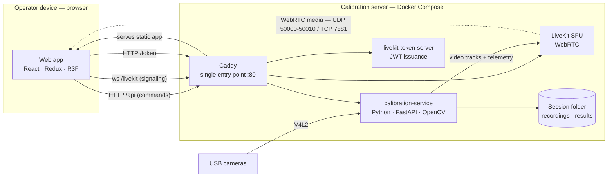
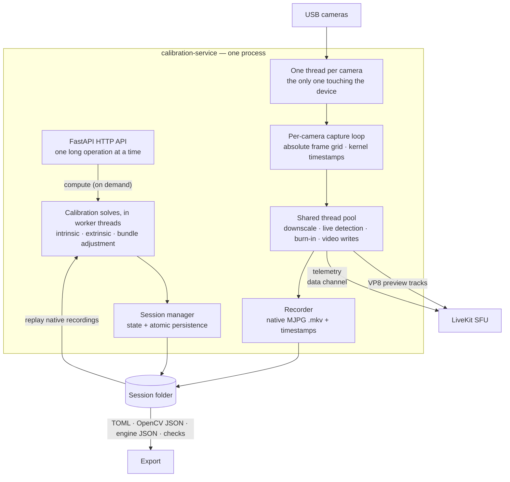

# Architecture overview

realtime-calib is a small set of services orchestrated with Docker Compose, built around one idea: the heavy lifting (capture, detection, calibration) happens on the **server the cameras are plugged into**, and the operator drives it from a **web app on any device** over the local network.

## How this project was built

I'm a **PhD in human-movement science and a computer-vision developer**: my work is building applied technology for **health and sport**. I'll delimit my expertise up front, the way a researcher scopes their field before presenting a result — because it matters here. I'm comfortable with engineering, product design and *applying* computer vision, but I do **not** have deep training in the projective geometry and epipolar mathematics that underpin camera calibration.

So for the calibration theory I stand on **Caliscope** and **OpenCV**, and I used **Claude Code (Opus 4.8, then Opus 5.5)** to write the code and to explain the harder concepts as I went.

I first used Caliscope in my own work. It calibrates well, but a few frictions kept getting in the way — recording every camera in OBS first, no headless path, and export conventions that didn't match my projects. As VR and robotics keep growing the need for multi-camera rigs, it seemed worth turning a friction-free version into something others could use too.

My own contribution is therefore the **product and engineering shape**, not the calibration math: a **single-pass, multi-device** tool — a responsive web app that captures *and* calibrates in one flow, usable on **headless Linux** servers — and the **architecture and stack** (a dual-channel WebRTC React application over LiveKit).

## System topology

```mermaid
graph LR
    subgraph operator [Operator device — browser]
        WA[Web app<br/>React · Redux · R3F]
    end

    subgraph host [Calibration server — Docker Compose]
        CADDY[Caddy<br/>single entry point :80]
        CS[calibration-service<br/>Python · FastAPI · OpenCV]
        TS[livekit-token-server<br/>JWT issuance]
        LK[LiveKit SFU<br/>WebRTC]
        FS[(Session folder<br/>recordings · results)]
    end

    CAMS[USB cameras] -->|V4L2| CS
    WA -->|"HTTP /api (commands)"| CADDY
    WA -->|"ws /livekit (signaling)"| CADDY
    WA -->|"HTTP /token"| CADDY
    CADDY -->|serves static app| WA
    CADDY --> CS
    CADDY --> TS
    CADDY --> LK
    CS -->|video tracks + telemetry| LK
    LK -.->|"WebRTC media — UDP 50000-50010 / TCP 7881"| WA
    CS --> FS
```

| Service | Role | Stack |
| --- | --- | --- |
| `calibration-service` | Capture, board detection, overlay burn-in, LiveKit publishing, calibration solves (intrinsic / extrinsic / bundle adjustment), HTTP API, session state | Python 3.14, FastAPI + asyncio, OpenCV, SciPy, LiveKit SDK |
| `calibration-webapp` | Operator wizard + 3D review, served as static files by Caddy | React, TypeScript, Vite, Mantine, Redux Toolkit, R3F/drei |
| `livekit-token-server` | Issues subscribe-only LiveKit JWTs to the web app | Python (Flask) |
| `caddy` | Reverse proxy and static serving, plain HTTP — the **only host-exposed entry point** | Caddy v2 |
| `livekit` | WebRTC SFU carrying the camera streams and the telemetry data channel | upstream `livekit/livekit-server` |

It is a **single stack**: Caddy is the always-on entry point, in plain HTTP on the local network — tablet via `http://<HOST_IP>`, same-machine via `http://localhost`. No certificate is involved: the web app only receives video and data, which browsers allow without a secure context. Caddy routes `/api` to the calibration service, `/token` to the token server, `/livekit` to LiveKit signaling, and serves the web app for everything else. Only the WebRTC **media** flows outside Caddy, directly between browser and SFU.

## Two channels: commands vs. real time

The web app talks to the server over two complementary paths:

- **HTTP (through `/api`)**: everything transactional: create, open or import sessions, configure cameras and boards, start and stop recordings, trigger computes, run the pre-export checks, export. The service owns the session state; the web app rehydrates from it.
- **WebRTC (through LiveKit)**: everything continuous: one video track per camera (with detection overlays burned in server-side), plus a **data channel** pushing live telemetry: coverage, sharpness, co-visibility, and a snapshot of every camera's health (live, opening, in error, with the reason). The snapshot is resent on every tick rather than as one-off events, so a dropped packet or a tablet that joins late catches up within a second.

## Inside the calibration service

A single process: an asyncio event loop for the API and the orchestration, and threads for everything that blocks.

```mermaid
graph TD
    subgraph svc [calibration-service — one process]
        API[FastAPI HTTP API<br/>one long operation at a time]
        LOOP[Per-camera capture loop<br/>absolute frame grid · kernel timestamps]
        DEV[One thread per camera<br/>the only one touching the device]
        POOL[Shared thread pool<br/>downscale · live detection · burn-in · video writes]
        REC[Recorder<br/>native MJPG .mkv + timestamps]
        SOLVE[Calibration solves, in worker threads<br/>intrinsic · extrinsic · bundle adjustment]
        SM[Session manager<br/>state + atomic persistence]
    end

    CAM[USB cameras] --> DEV --> LOOP
    LOOP --> POOL
    POOL -->|VP8 preview tracks| LK[LiveKit SFU]
    POOL -->|telemetry<br/>data channel| LK
    POOL --> REC --> DISK[(Session folder)]
    API -->|"compute (on demand)"| SOLVE
    DISK -->|replay native recordings| SOLVE
    SOLVE --> SM --> DISK
    DISK -->|TOML · OpenCV JSON · engine JSON · checks| EXPORT[Export]
```

Key properties:

- **Recording stays native, the preview is light.** Recordings are written at the camera's native resolution, with each frame's timestamp. The live preview is downscaled (at most 960 px wide) for streaming, and live detection runs on that preview: it only drives the operator's feedback. The preview follows the camera's frame rate, or a reduced rate set in Settings.
- **Solves are on-demand and replay-based.** A sweep is recorded first, then the compute re-detects the board on the native recording with the operator's Prepare settings (trim, stride, caps), in a worker thread so the live preview never freezes.
- **Devices are never released mid-read.** Each open camera has its own thread, which serializes open, grab and release, so stopping a capture can never close a device while a frame is being read. A camera that fails to open or stops delivering frames is reported to the operator and reopened with a backoff.
- **One long or mutating operation at a time.** Computes, Minimize, recording starts, session changes and camera or board changes take a single service-wide slot; a second request gets a "busy" answer instead of interleaving with the first.
- **The session folder is the source of truth.** Recordings, board config and results all live there, written atomically (a crash never leaves a half-written file); the web app holds no durable state and rehydrates from the service on load.
- **CPU-only.** No GPU required; the heavy cost is OpenCV detection, while the bundle adjustment itself takes under a second.
